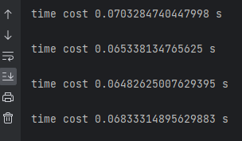
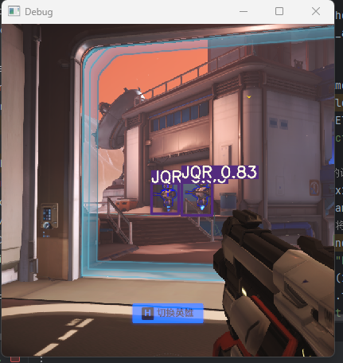

# FPS-Yolov7-aim-assist

## FPS 辅助瞄准工具
### 声明
  - 本项目仅限于学习交流,不可用于非法用途（包括但不限于：用于制作游戏外挂等）
  - 使用本项目产生的任何后果与本人无关
  - 使用本项目则默认同意本声明

### 简介
 -  本项目基于yolov7，采用多进程和线程方式，实现了一款FPS类游戏的自瞄AI，本项目旨在使用现有网络结构实现一个完整的落地项目，仅供人工智能自动控制等方面的学习研究，不可用于非法用途！！！

### 操作鼠标
调用罗技驱动, 已有大佬已经搭过桥了, 有现成的调用驱动的dll, 只是需要安装指定版本的罗技驱动配合才行
https://pan.baidu.com/s/1VkE2FQrNEOOkW6tCOLZ-kw?pwd=yh3s
#### 罗技驱动分 LGS (老) 和 GHub (新)
- LGS, 需要使用 9.02.65 版本
- GHub, 需要使用 2021.11 版本之前的, 因 2021.11 版本存在无法屏蔽自动更新的问题, 所以暂时建议选 2021.3 版本
#### 另外需要确保 控制面板-鼠标-指针选项 中下面两个设置
- 提高指针精确度 选项去掉, 不然会造成实际移动距离变大
- 选择指针移动速度 要在正中间, 靠右会导致实际移动距离过大, 靠左会导致指针移动距离过小

### 展示
* **单次检测和移动时间**

* **检测截图**

* **自瞄效果展示**

<ifrname height=500 width=500 src="readme_file/Automatic_aiming.wmv"></ifrname>

----------------------------------
## 支持

[Python Apex YOLO V7 main 目标检测 全过程记录](https://blog.csdn.net/mrathena/article/details/127582234)

[detect.py制作成API接口供其他python程序调用](https://blog.csdn.net/weixin_51331359/article/details/126012620)

[https://github.com/chaoyu1999/FPSAutomaticAiming](https://github.com/chaoyu1999/FPSAutomaticAiming)